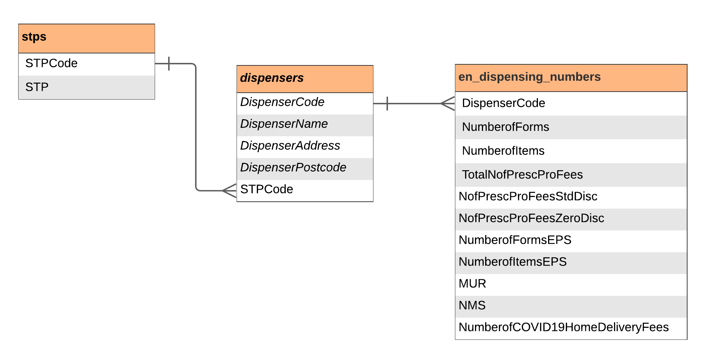

#  PharmacyAnalytics

[PharmacyAnalytics](https://pharmacyanalytics.co.uk/) is a personal, pharmacy focused data project. The following contents will be available:

* Project datasets (processed using `process_raw_data.py` and can be imported in a notebook using `prepare_data_from_csv.py`)
* Kaggle datasets (prepared using `prepare_data_from_csv.py`)
* Project notebooks for EDA
* Kaggle notebooks to showcase dataset properties, share insights

To get in touch, you can use one of the following:

* **Twitter:** [@PAnalyticsUK](https://twitter.com/PAnalyticsUK)
* **LinkedIN Profile:** [@rdmdmr](https://www.linkedin.com/in/rdmdmr/)
* **Kaggle Profile:** [@erdemdemir](https://www.kaggle.com/erdemdemir)

## Datasets

### England Pharmacy Contractor Dispensing Data

- **Source: **[NHSBSA](https://www.nhsbsa.nhs.uk/prescription-data/dispensing-data/dispensing-contractors-data)
- **Extracted Tables:** 
    - [en_dispensing_numbers](data/en_dispensing_numbers)
    - [dispensers](data/dispensers)
    - [stps](data/stps)
- **Kaggle Dataset:** [England Pharmacy Contractor Dispensing Data](https://www.kaggle.com/erdemdemir/england-pharmacy-contractor-dispensing-data)
- **Project Notebooks:**
    - [England Pharmacy Dispensing Data EDA](notebooks/en_dispensing_numbers_EDA.ipynb)

## Licence

 PharmacyAnalytics by <a xmlns:cc="http://creativecommons.org/ns#" href="https://github.com/erdemdemir/pharmacy-analytics" property="cc:attributionName" rel="cc:attributionURL">Erdem Demir</a> is licensed under a <a rel="license" href="http://creativecommons.org/licenses/by-nc-sa/4.0/">Creative Commons Attribution-NonCommercial-ShareAlike 4.0 International License</a>.